# TimeArch KERKIS — Mermaid figures

**Drawn figures (PNG):** [figures gallery](./figures.html) · folder [`figures/`](./figures/)

Import Mermaid into [draw.io](https://app.diagrams.net/) via **Arrange → Insert → Advanced → Mermaid**.  
Full narrative: [KERKIS-TimeArch-Meta-Composition.md](./KERKIS-TimeArch-Meta-Composition.md) · Prompt: [KERKIS-CHATGPT-PROMPT.md](./KERKIS-CHATGPT-PROMPT.md)

---

## Drawn figure index

| # | Figure | PNG |
|---|--------|-----|
| 1 | KERKIS lenses | 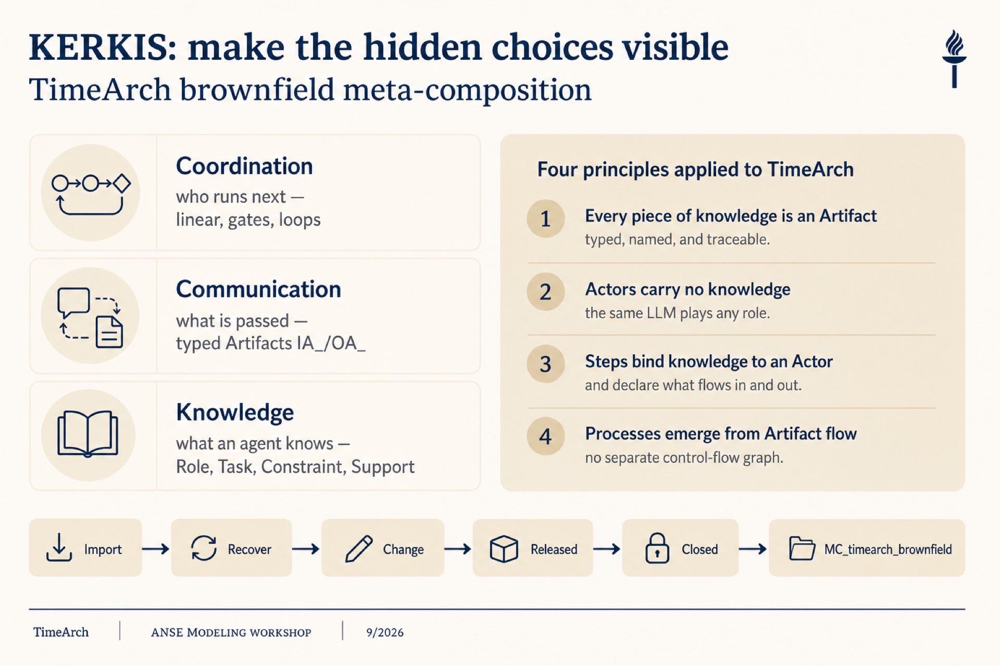 |
| 2 | Four constructs | 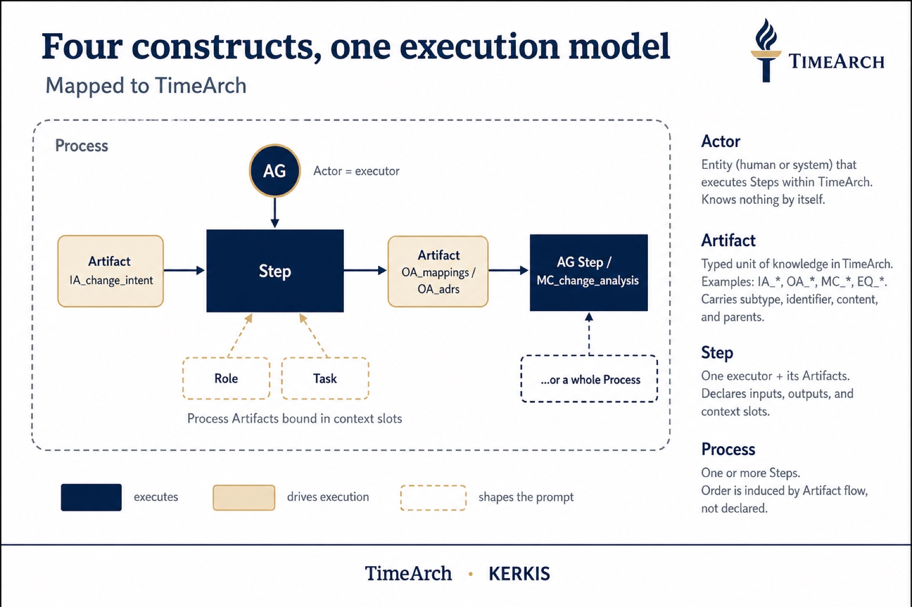 |
| 3 | Actor kinds | 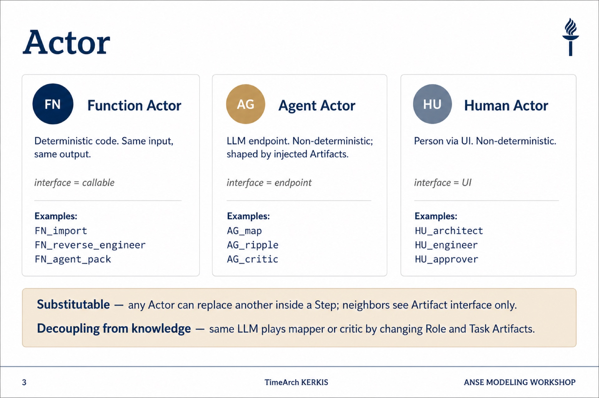 |
| 4 | AG Step detail | 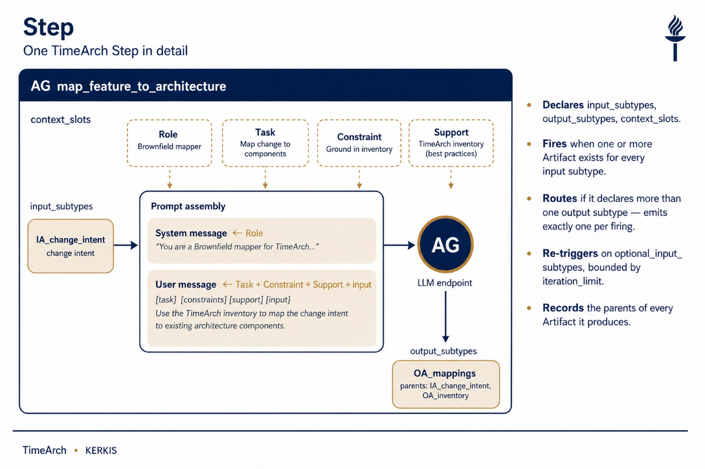 |
| 5 | Linear SOP | 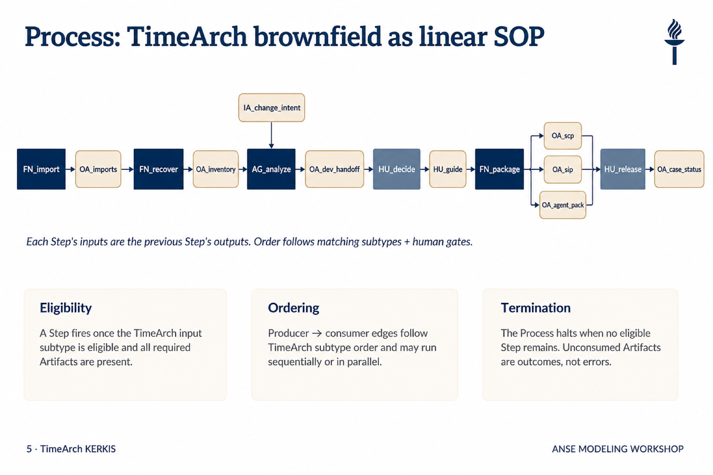 |
| 6 | Routing & feedback | 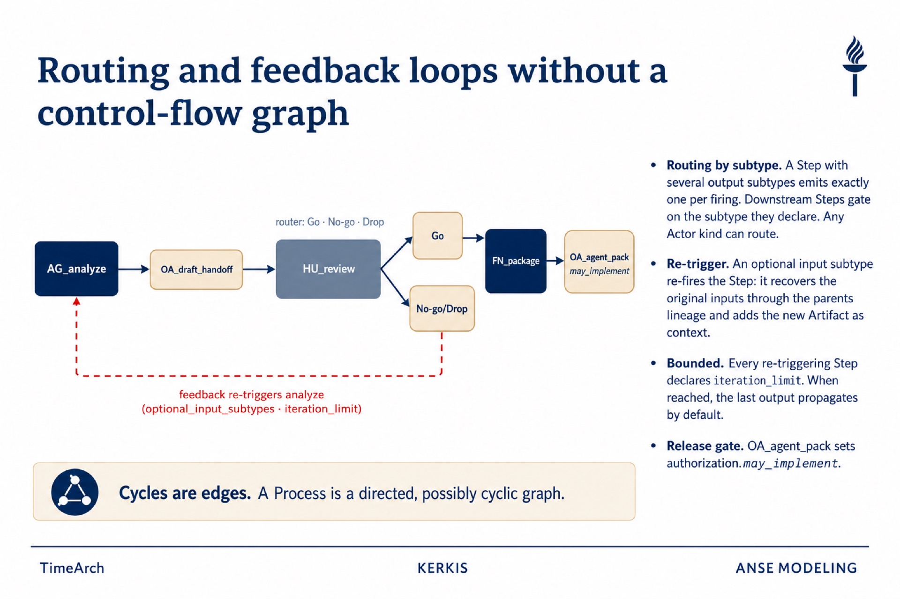 |
| 7 | **FINAL Meta-composition** | 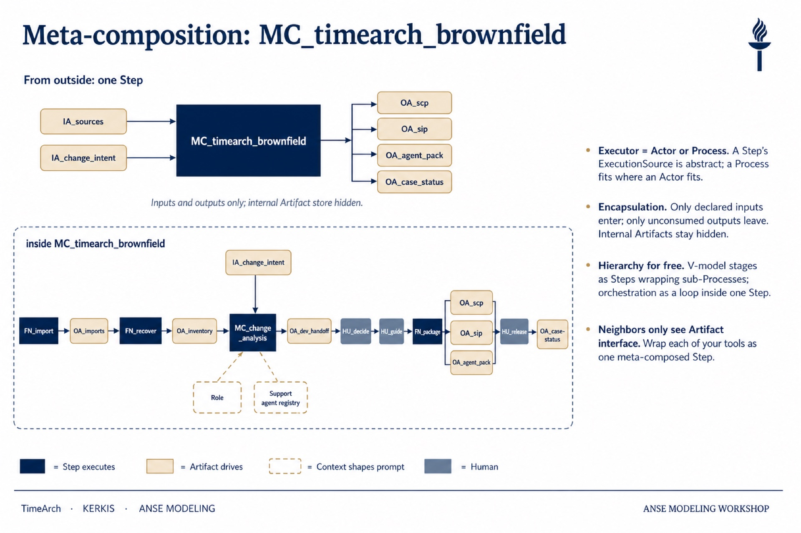 |
| 8 | Nested orchestrator | 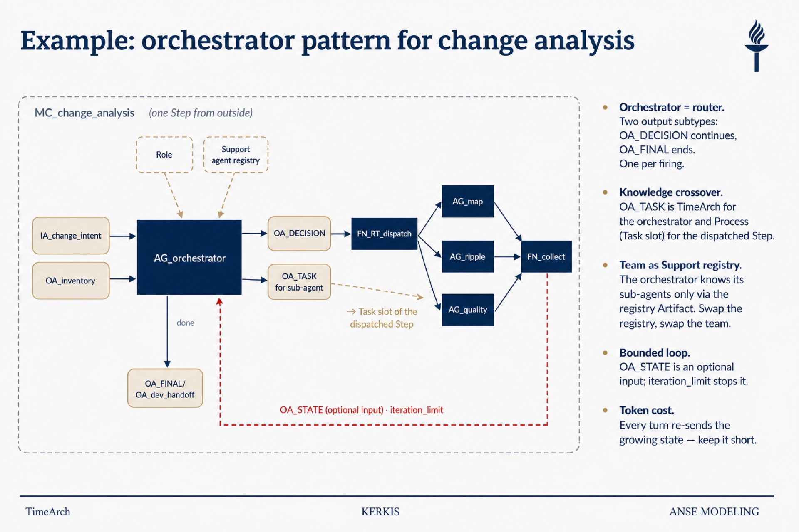 |

---

## Figure 1 — KERKIS lenses for TimeArch

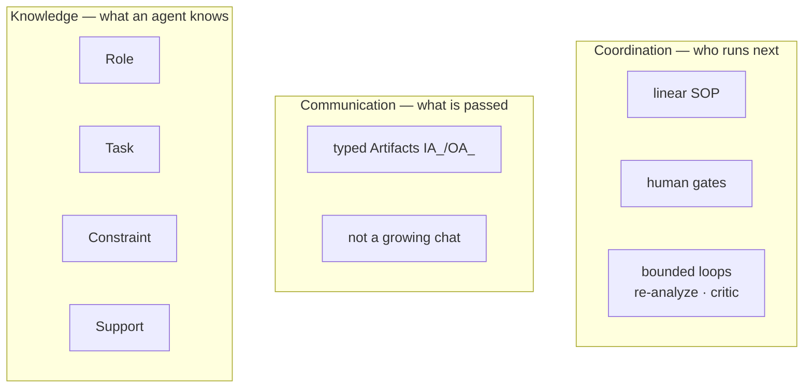

---

## Figure 2 — Four constructs, one execution model

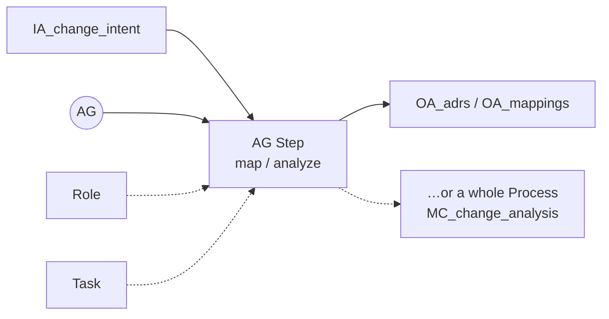

---

## Figure 3 — Actor kinds in TimeArch

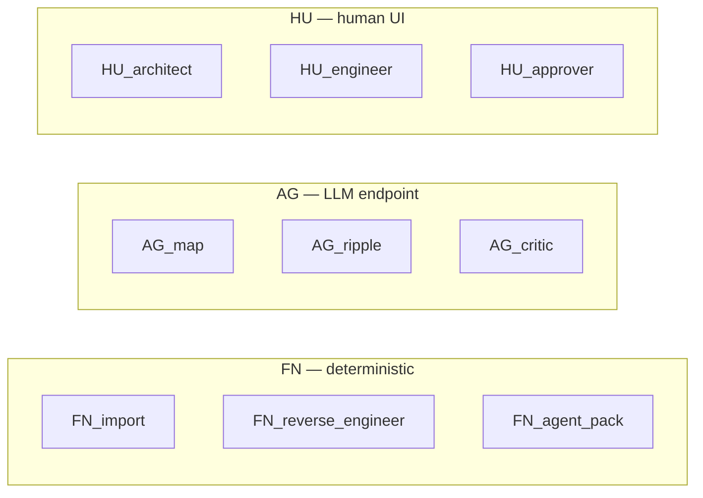

---

## Figure 4 — AG Step detail: map_feature_to_architecture

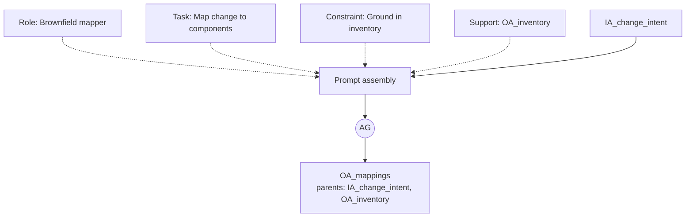

---

## Figure 5 — Linear SOP (brownfield)

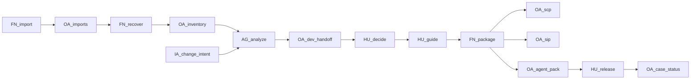

*Each Step’s inputs are the previous Step’s outputs. Order follows matching subtypes + human gates.*

---

## Figure 6 — Routing and feedback

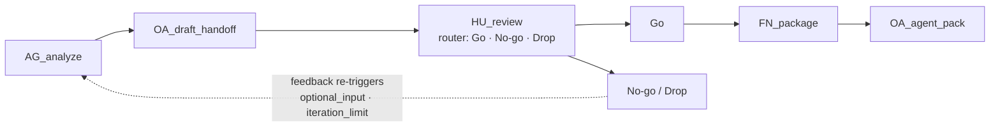

---

## Figure 7 — FINAL Meta-composition

### Outside

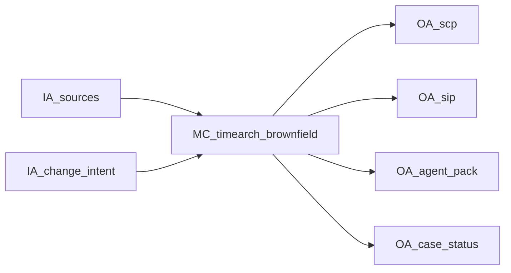

*From outside: one Step. Inputs and outputs only; internal Artifact store hidden.*

### Inside

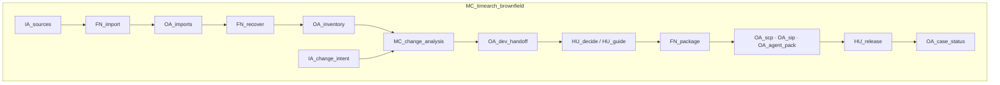

| Rule | Meaning |
|------|---------|
| Executor = Actor or Process | `MC_change_analysis` fits where an AG Step fits |
| Encapsulation | Only declared IA enter; only unconsumed OA leave |
| Hierarchy for free | Milestones wrap nested analysis Process |
| Artifact interface | Neighbors never see mappings/traces/UI |

---

## Figure 8 — Nested MC_change_analysis (orchestrator pattern)

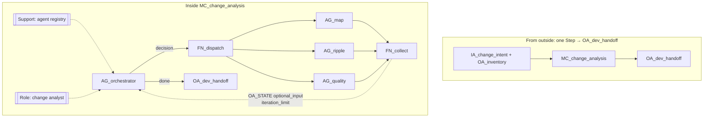

---

## Master narrative (title slide)

**TimeArch as KERKIS meta-composition:** a brownfield Process that binds Role/Task knowledge to FN, AG, and HU Actors, moves typed Artifacts from sources to inventory to decisions, and wraps as **MC_timearch_brownfield** — exposing only a Change Proposal, Build Plan, gate-aware `agent_pack.json`, and case status to the software factory.
