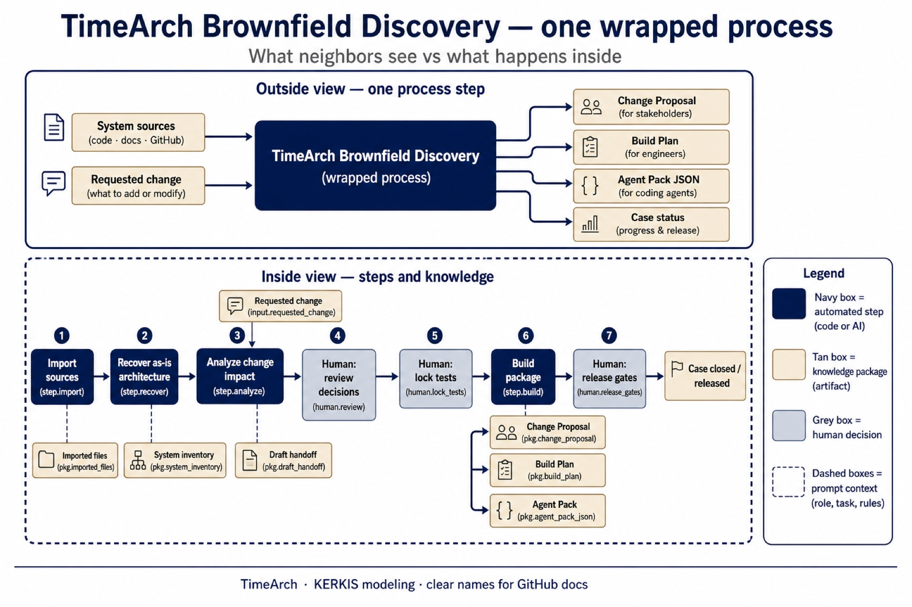
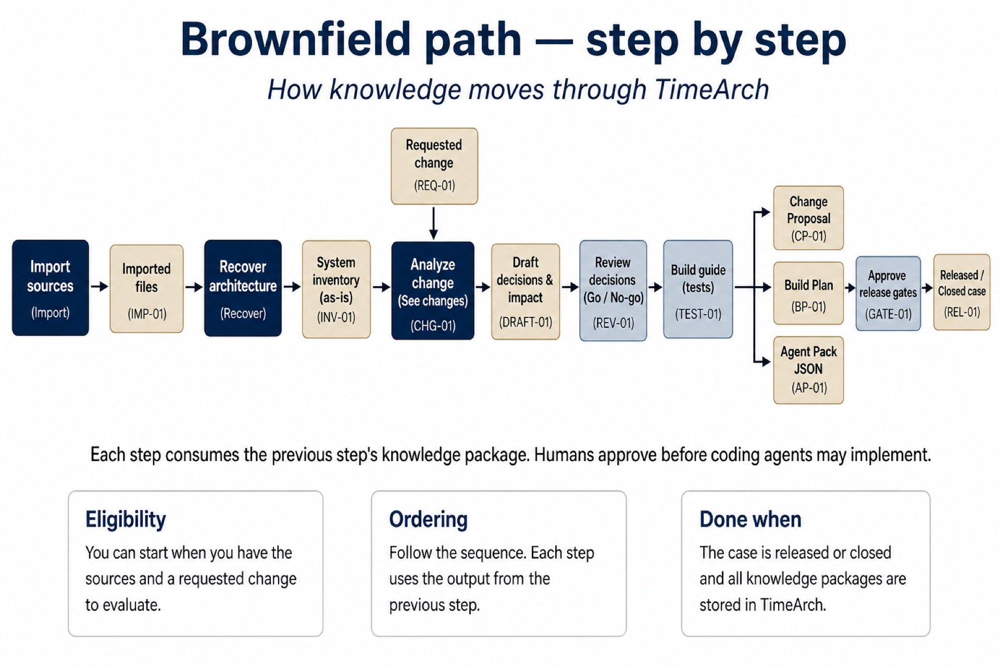
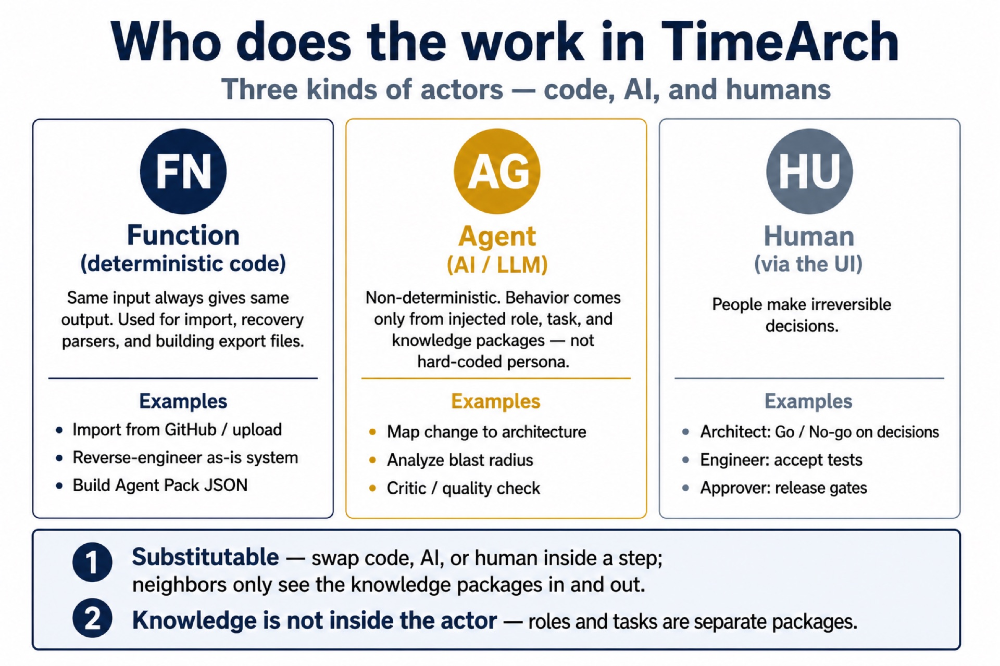
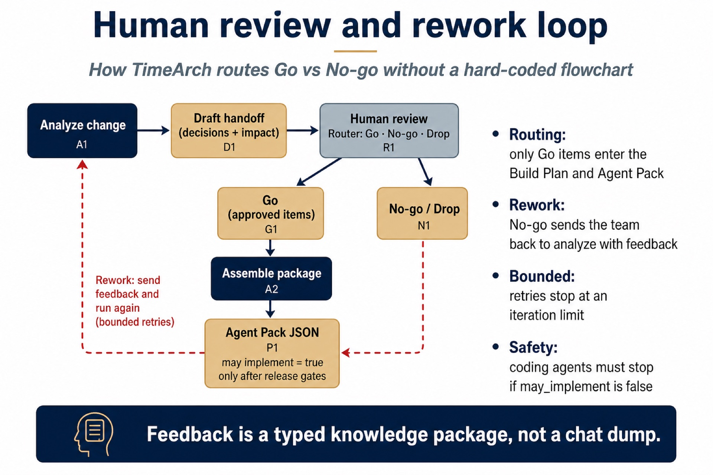
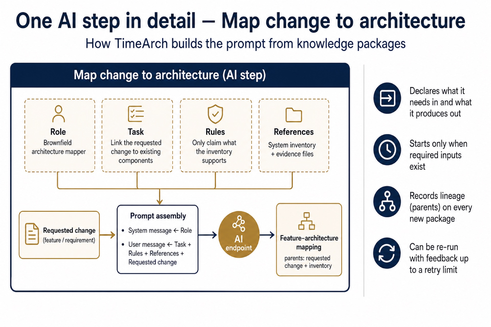
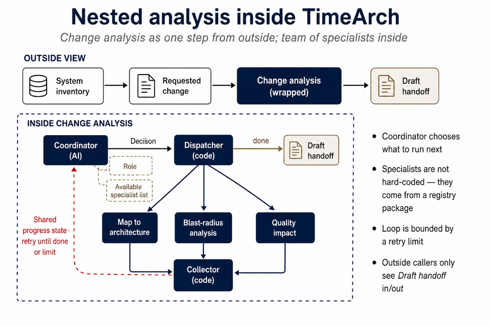

# Figure catalog

Each figure has a **clear title**, a **one-line purpose**, and a short **what to notice** list.  
Technical IDs are optional; prefer clear names when presenting.

**Gallery (all images):** [../gallery.html](../gallery.html)

---

## 01 — TimeArch Brownfield Discovery (wrapped process)

| | |
|--|--|
| **File** | `01-timearch-brownfield-wrapped-process.jpg` |
| **Purpose** | Show TimeArch as **one process** to the outside world, and the steps inside. |
| **Was called** | “Meta-composition” / `MC_timearch_brownfield` |

**What to notice**

- **Outside:** System sources + Requested change → Change Proposal, Build Plan, Agent Pack, Case status  
- **Inside:** Import → Recover → Analyze → Human review → Assemble package → Release  
- Neighbors never see internal mappings, traces, or UI details  

---

## 02 — Brownfield path — step by step

| | |
|--|--|
| **File** | `02-brownfield-step-by-step.jpg` |
| **Purpose** | Walk the full brownfield journey as a linear knowledge pipeline. |
| **Was called** | “Linear SOP” |

**What to notice**

- Each step consumes the previous knowledge package  
- Humans sit on decisions, tests, and release  
- Ends in Released / Closed case status  

---

## 03 — Who does the work

| | |
|--|--|
| **File** | `03-who-does-the-work.jpg` |
| **Purpose** | Explain the three worker kinds: **code**, **AI**, **human**. |
| **Was called** | “Actors” |

**What to notice**

- Code = deterministic import / recover / export  
- AI = mapping, impact, critic (shaped by role & task packages)  
- Humans = Go/No-go and release gates  
- Workers are substitutable; knowledge is not baked into the worker  

---

## 04 — Human review and rework loop

| | |
|--|--|
| **File** | `04-human-review-and-rework.jpg` |
| **Purpose** | Show Go vs No-go routing and bounded re-analyze. |
| **Was called** | “Routing and feedback” |

**What to notice**

- Only **Go** items enter Build Plan / Agent Pack  
- **No-go** sends feedback back to Analyze (limited retries)  
- Agent Pack stays non-implementable until release gates pass  

---

## 05 — One AI step in detail

| | |
|--|--|
| **File** | `05-one-ai-step-in-detail.jpg` |
| **Purpose** | Zoom into *Map change to architecture*: role, task, rules, references → prompt → mapping. |
| **Was called** | “AG Step detail” |

**What to notice**

- Context packages shape the prompt  
- Output records **parents** (lineage)  
- Same AI endpoint can play another role by swapping context packages  

---

## 06 — Nested change analysis

| | |
|--|--|
| **File** | `06-nested-change-analysis.jpg` |
| **Purpose** | Show change analysis as one wrapped step outside, specialists + coordinator inside. |
| **Was called** | “Nested orchestrator / meta-composition” |

**What to notice**

- Outside only sees Draft handoff  
- Inside: Coordinator → Dispatcher → Map / Blast-radius / Quality → Collector  
- Progress loop is bounded by a retry limit  

---

## Archive

Previous drafts with cryptic labels (`fig01-…` … `fig08-…`) are in [`archive/`](./archive/). Prefer the six figures above for talks and GitHub.
