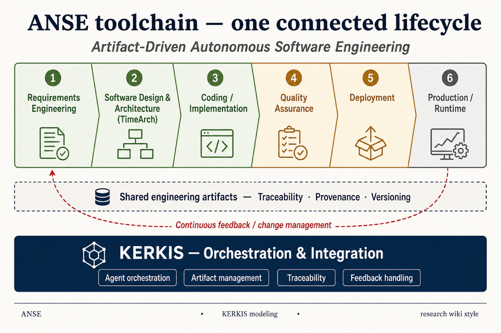
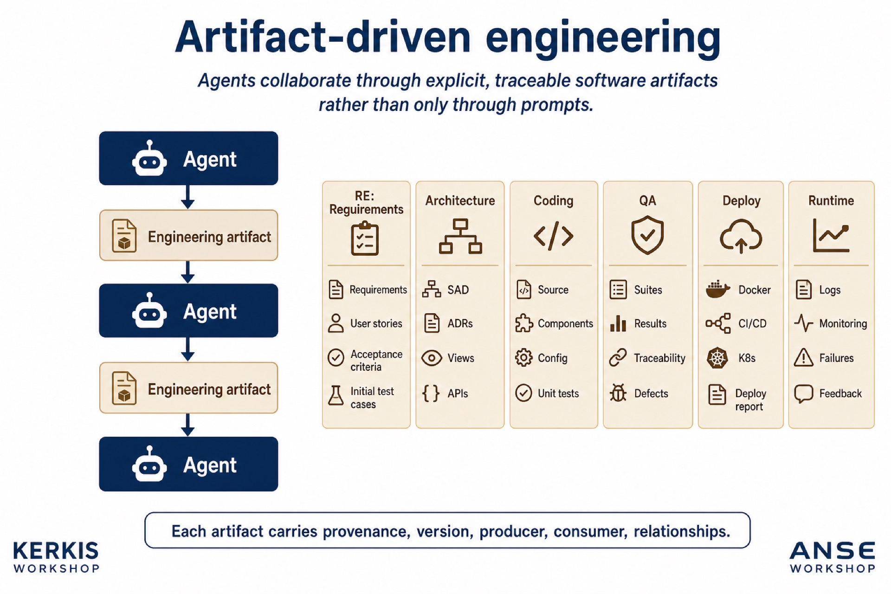
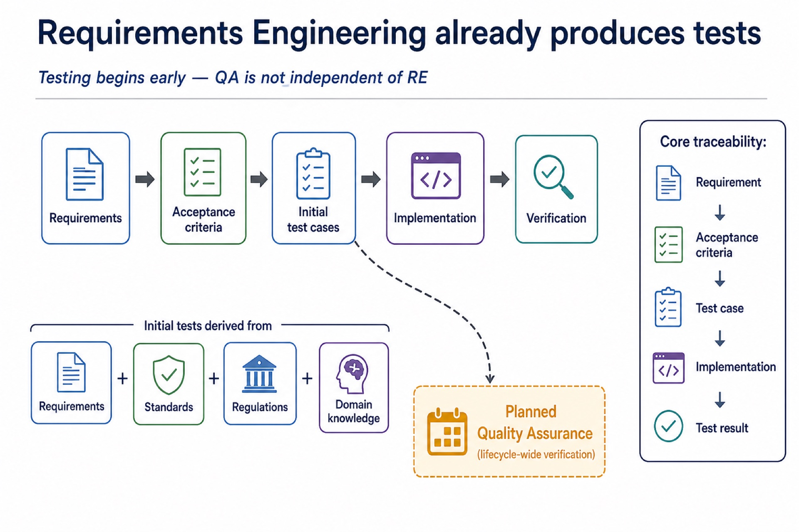
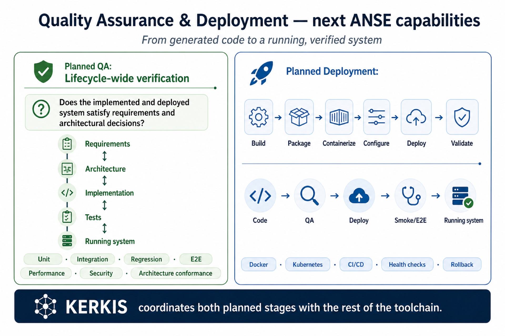
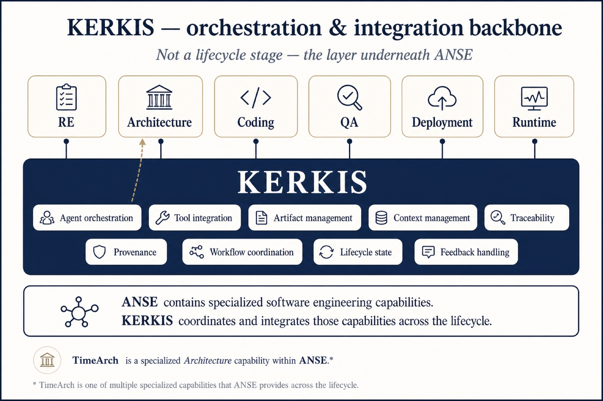
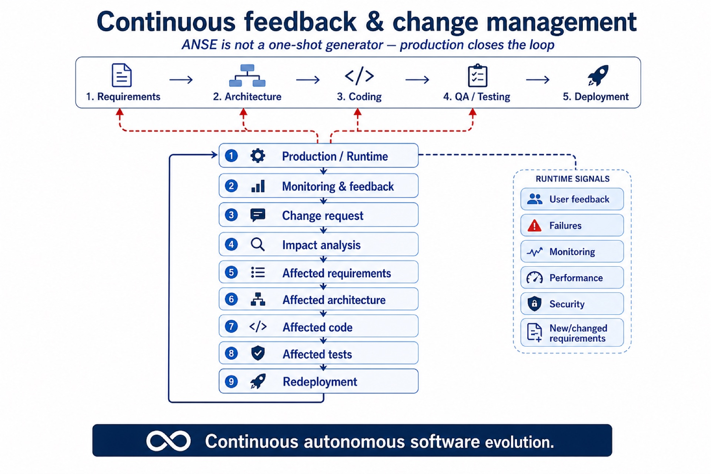

# ANSE + KERKIS figures

Workshop-style slides for the overall **ANSE** toolchain and **KERKIS** backbone.  
Interactive page: [`../../wiki/anse.html`](../../wiki/anse.html) · Gallery: [`../../gallery.html`](../../gallery.html)

---

## anse-01 — ANSE lifecycle and KERKIS

| | |
|--|--|
| **Purpose** | One connected lifecycle with Existing / Planned / Runtime status, shared artifacts, and KERKIS underneath. |

**What to notice**

- Existing: Requirements · Architecture (TimeArch) · Coding  
- Planned: Quality Assurance · Deployment  
- Runtime: Production — with continuous feedback  
- KERKIS is **not** a stage; it is the orchestration layer  

---

## anse-02 — Artifact-driven engineering

| | |
|--|--|
| **Purpose** | Show Agent → Artifact → Agent collaboration and per-stage artifact packages. |

**Pullquote:** Agents collaborate through explicit, traceable software artifacts rather than only through prompts.

---

## anse-03 — Requirements → testing

| | |
|--|--|
| **Purpose** | Testing starts in RE: requirements → acceptance criteria → initial test cases → verification. |

---

## anse-04 — QA and Deployment (next)

| | |
|--|--|
| **Purpose** | Planned capabilities: lifecycle-wide verification and path to a running, verified system. |

---

## anse-05 — KERKIS backbone

| | |
|--|--|
| **Purpose** | KERKIS responsibilities spanning every ANSE stage. |

---

## anse-06 — Continuous feedback

| | |
|--|--|
| **Purpose** | Production signals → change request → impact → re-enter RE/Arch/Code/Tests → redeploy. |

---

## PDF

[TimeArch-ANSE-KERKIS-Process-Figures.pdf](../../exports/TimeArch-ANSE-KERKIS-Process-Figures.pdf) — cover + figures 01–06.
