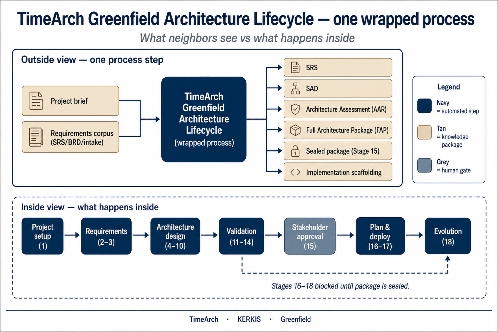
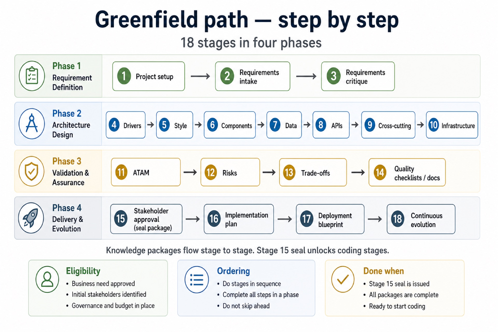
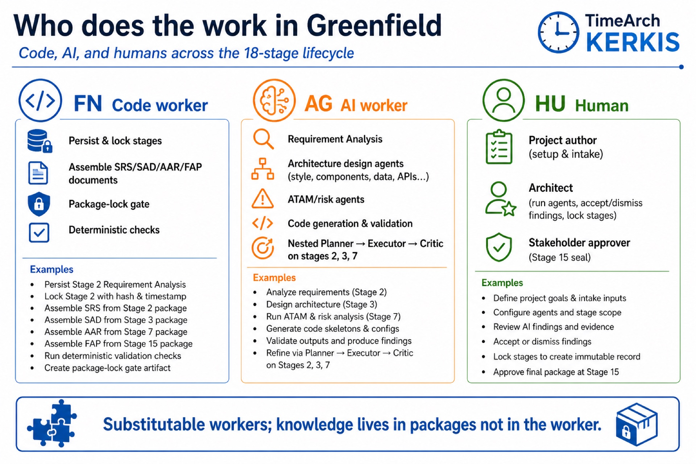
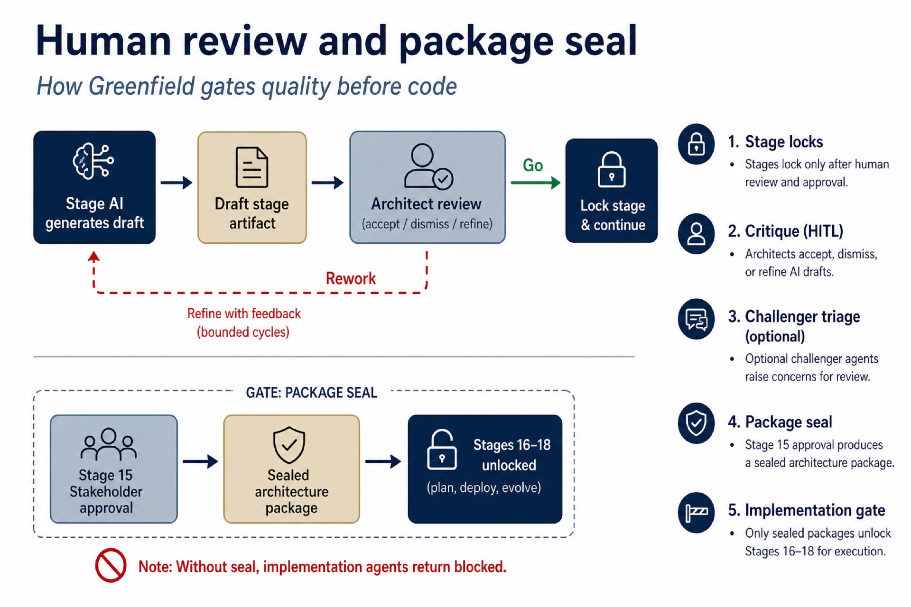
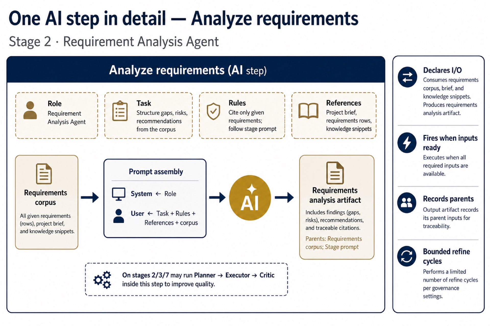
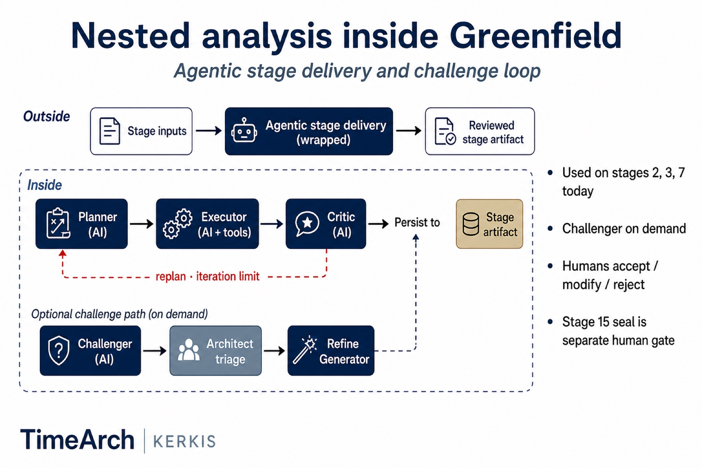

# Greenfield figures

Clear-named slides for **TimeArch Greenfield Architecture Lifecycle** (stages 1–18).  
Brownfield set: [../README.md](../README.md) · Gallery: [../../gallery.html](../../gallery.html)

---

## gf-01 — TimeArch Greenfield Architecture Lifecycle (wrapped process)

| | |
|--|--|
| **File** | `gf-01-greenfield-wrapped-process.jpg` |
| **Purpose** | Show greenfield TimeArch as **one process** outside, four phases inside. |
| **Technical ID** | `MC_timearch_greenfield` |

**What to notice**

- **Outside:** Project brief + Requirements → SRS, SAD, AAR, FAP, Sealed package, Scaffolding  
- **Inside:** Setup → Requirements → Architecture → Validation → Approval → Plan/Deploy → Evolution  
- Stages 16–18 wait for Stage 15 seal  

---

## gf-02 — Greenfield path — step by step

| | |
|--|--|
| **File** | `gf-02-greenfield-step-by-step.jpg` |
| **Purpose** | Map all **18 stages** into four readable phases. |

**What to notice**

- Requirement Definition (1–3)  
- Architecture Design (4–10)  
- Validation & Assurance (11–14)  
- Delivery & Evolution (15–18) with human seal at 15  

---

## gf-03 — Who does the work (greenfield)

| | |
|--|--|
| **File** | `gf-03-who-does-the-work.jpg` |
| **Purpose** | Code · AI · Human roles across the lifecycle. |

**What to notice**

- Code: locks, document assembly, package-lock gate  
- AI: stage generators + nested Planner/Executor/Critic  
- Humans: author, architect review, Stage 15 approvers  

---

## gf-04 — Human review and package seal

| | |
|--|--|
| **File** | `gf-04-human-review-and-seal.jpg` |
| **Purpose** | Per-stage critique loop and Stage 15 seal that unlocks coding. |

**What to notice**

- Accept / dismiss / refine before locking a stage  
- Bounded refine cycles  
- Without seal, stages 16–18 stay blocked  

---

## gf-05 — One AI step — Analyze requirements

| | |
|--|--|
| **File** | `gf-05-one-ai-step-analyze-requirements.jpg` |
| **Purpose** | Zoom into Stage 2 Requirement Analysis Agent. |

**What to notice**

- Role / Task / Rules / References shape the prompt  
- Output is a requirements analysis artifact with lineage  
- May nest Planner → Executor → Critic  

---

## gf-06 — Nested agentic stage

| | |
|--|--|
| **File** | `gf-06-nested-agentic-stage.jpg` |
| **Purpose** | Inside view of agentic delivery + optional Challenger loop. |

**What to notice**

- Planner → Executor → Critic with bounded replan  
- Challenger is on-demand; architect triages concerns  
- Used today on stages **2, 3, 7**  

---

## Narrative (title slide)

**TimeArch Greenfield Architecture Lifecycle** binds Role/Task knowledge to code, AI, and human workers across eighteen stages, wraps as one process for partners, and releases implementation scaffolding only after a sealed architecture package.
