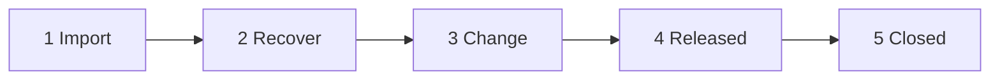
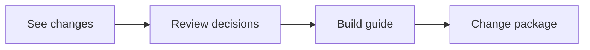

# Brownfield Discovery

How to import an existing system, recover its architecture, and produce an approved change package for stakeholders and coding agents.

---

## Overview

Brownfield discovery follows **five milestones**. The dashboard shows progress as `N/5` with the current phase name.



| Milestone | What you do | Done when |
|-----------|-------------|-----------|
| **Import** | Upload code, docs, or a GitHub repo | At least one import succeeds |
| **Recover** | Reverse-engineer as-is architecture | Recovery artifacts exist |
| **Change** | Propose changes, decide, build guide, package | Change package saved |
| **Released** | All release gates approved | Package status = approved |
| **Closed** | Close the discovery case | Project locked; case artifact stored |

Greenfield projects use the **18-stage lifecycle** instead. Brownfield cases never show "0 of 18" — they use this 5-milestone model.

---

## Step 1 — Import

**Goal:** Bring the existing system into TimeArch.

Supported sources:

- **GitHub repository** — public URL, or private with `GITHUB_TOKEN` configured on the backend
- **File upload** — ZIP, source trees, SRS, OpenAPI, SQL, etc.
- **Demo pack** — bundled ShopFlow example under `public/demo/brownfield/`

After import, review the file list and proceed to **Recover**.

> **Tip:** For private GitHub repos locally, add a personal access token to your Supabase function secrets as `GITHUB_TOKEN`.

---

## Step 2 — Recover

**Goal:** Build an as-is picture of the system.

TimeArch runs reverse-engineering agents to produce:

- **System inventory** — components, APIs, data stores, **current features**
- **Architecture narrative** and Mermaid **as-is** diagram
- **Evidence** links back to imported files

Review findings in the **Recover** step. When satisfied, move to **Change**.

You can re-run recovery after new imports (drift detection compares baseline vs current).

---

## Step 3 — Change

Inside **Change**, each revision walks **four sub-steps**:



### 3a. See changes

- Select or compose proposed requirements / feature changes.
- Click **Re-analyze** to run the brownfield pipeline (mapping, impact, ADRs, acceptance criteria, tests).
- Review impact diagram, affected files, and proposed to-be architecture.

### 3b. Review decisions

- Every **ADR** gets a verdict: **Go**, **No-go**, or **Drop**.
- Edit decisions before locking them.
- Only **Go** items flow into the build guide and package.

### 3c. Build guide

- **Acceptance criteria** and **tests** get the same Go / No-go / Drop treatment.
- This step is the engineer-facing checklist: what must be true before release.

### 3d. Change package

The package has **four tabs**:

| Tab | Audience | Contents |
|-----|----------|----------|
| **Proposal** | Stakeholders | SRS-style change proposal — cover, TOC, numbered sections, as-is / to-be figures |
| **Build plan** | Engineers | Implementation build plan derived from Go decisions |
| **Machine record** | Coding agents / CI | Summary, gates, scope, `agent_pack.json` download |
| **Release** | Approvers | Gate checklist; approve when ready |

**Exports** (from the Proposal / Build plan tabs):

- On-screen pages: Cover → Table of contents → Body
- **PDF** and **Word** with page breaks after cover and TOC
- **Markdown** copy for wikis or PRs

---

## Documents vs machine JSON

TimeArch deliberately separates **human documents** from **machine handoff**:

| Output | Format | Use |
|--------|--------|-----|
| Change Proposal (SCP) | PDF / DOCX / on-screen | Stakeholder sign-off |
| Implementation Build Plan (SIP) | PDF / DOCX / on-screen | Engineer execution brief |
| `agent_pack.json` | JSON (`kind: "agent_pack"`, schema v4) | Paste into Cursor, Claude, or your coding pipeline |

### What is in `agent_pack.json`?

Key sections a coding agent should read first:

```json
{
  "kind": "agent_pack",
  "schema_version": 4,
  "authorization": { "may_implement": true, "gates_approved": 3, "gates_total": 3 },
  "implement_now": {
    "allowed": true,
    "target_files": ["src/..."],
    "required_adrs": [],
    "required_acceptance_criteria": [],
    "required_tests": []
  },
  "agent_rules": ["Implement only scope.go_* items", "..."],
  "diagrams": { "as_is": "...", "to_be": "..." }
}
```

If `implement_now.allowed` is `false`, the agent must **stop** and wait for human approval.

Full SDP layout for orchestrators: [Software Delivery Package (SDP)](./Software-Delivery-Package.md).

---

## Step 4 — Released

Approve every **release gate** on the Release tab. When all gates pass:

- Package status becomes **approved**
- Dashboard shows milestone **4/5 — Released**
- The package is ready for external coding systems or the Orchestrator

---

## Step 5 — Closed

After implementation handoff (or when discovery is complete), **Close case**:

- Project status → `locked`
- Discovery case artifact persisted for audit
- Dashboard shows **5/5 — Closed**

---

## Reopening a project

Pipeline state is **restored** when you reopen a brownfield project — you do not need to re-analyze unless you change requirements or want refreshed diagrams.

If an older package is missing recovered features or Mermaid diagrams, run **Re-analyze** once on the active revision.

---

## Agent pipeline (backend)

Brownfield analysis invokes several edge functions in sequence, including:

- `reverse-engineer` — as-is recovery
- `map-feature-to-architecture` — feature ↔ component mapping
- `analyze-ripple` / `assess-quality-impact` — blast radius
- `run-brownfield-agent` — orchestrated change analysis
- `score-feature-changes` — prioritization signals

Long runs are asynchronous; the UI shows per-stage status during **Re-analyze**.

---

## See also

- [Getting Started](./Getting-Started.md)
- [Software Delivery Package (SDP)](./Software-Delivery-Package.md)
- [Software Factory Integration](./Software-Factory-Integration.md)
- [Diagrams — brownfield flow](./Diagrams.md#8-brownfield-discovery-flow)
- [Home](./Home.md)
