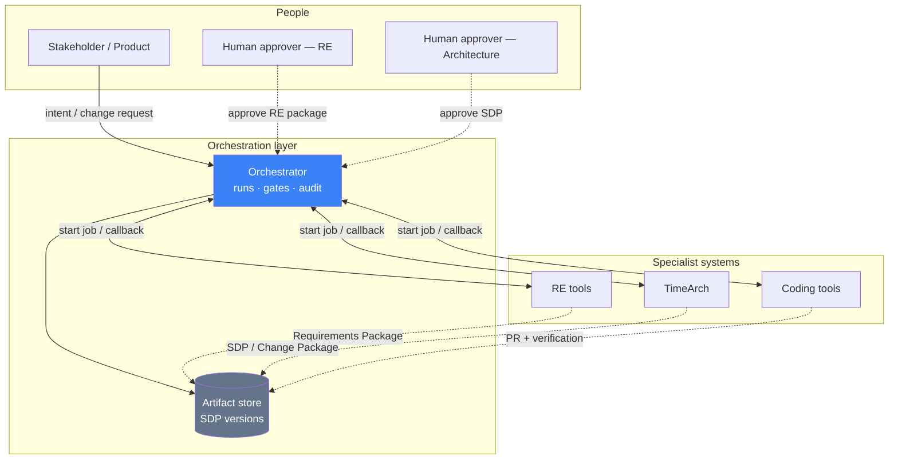
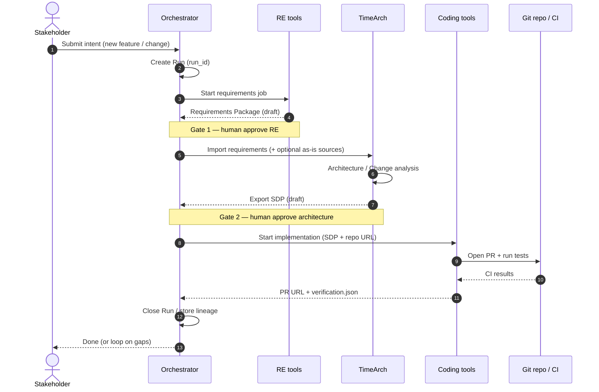
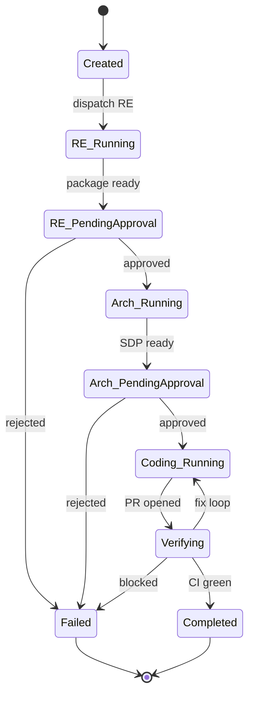
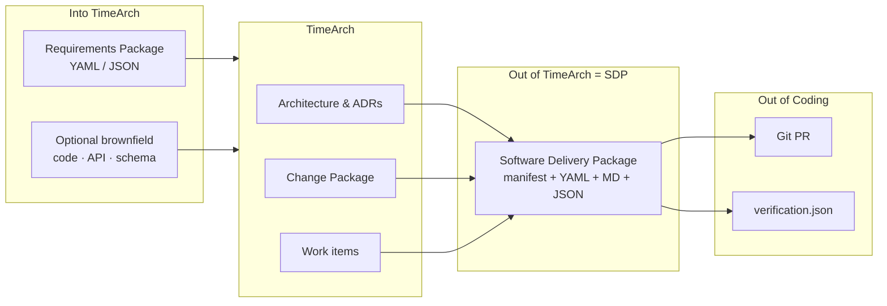
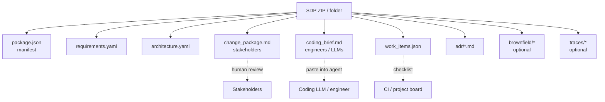
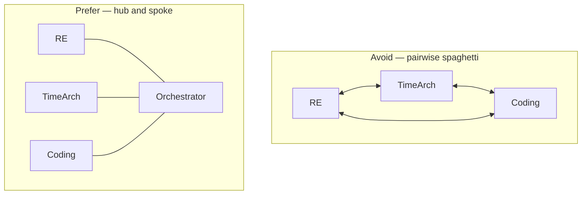
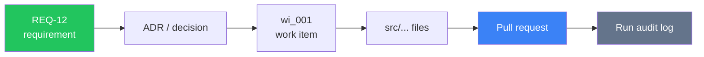

# Diagrams — Software Factory

Visual overview for partner meetings. All diagrams use [Mermaid](https://mermaid.js.org/) (renders on GitHub, GitLab, many Markdown previews, and Notion with a Mermaid block).

---

## 1. Big picture — hub and spoke

Tools never talk to each other directly. The **Orchestrator** is the only hub.

---

## 2. End-to-end sequence (happy path)

---

## 3. Run state machine

---

## 4. What moves between stages

---

## 5. SDP contents (artifact map)

---

## 6. Anti-pattern vs recommended

---

## 7. Lineage (requirement → code)

---

## How to present tomorrow

1. Start with **§1 Big picture** (hub).  
2. Walk **§2 Sequence** step by step.  
3. Show **§5 SDP** as “the only handoff”.  
4. End with **§6** — why not direct tool-to-tool links.

---

## See also

- [Software Factory Integration](./Software-Factory-Integration.md)  
- [Software Delivery Package (SDP)](./Software-Delivery-Package.md)  
- [Home](./Home.md)
