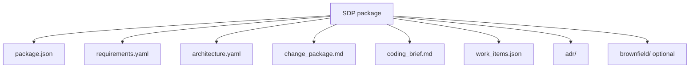

# Software Delivery Package (SDP)

**Status:** Draft schema v0.1 (for partner agreement)  
**Purpose:** Single handoff format from TimeArch (via Orchestrator) to Coding — and the durable record of a Run.

---

## 1. Design principles

1. **Dual audience** — humans (stakeholders, architects) and machines (coding LLMs, CI).  
2. **Immutable** — each export is versioned; never rewrite an accepted package in place.  
3. **Traceable** — every work item and requirement has a stable ID.  
4. **Repo-ready** — Coding’s job is a PR, not a chat transcript.

---

## 2. Package layout

One folder or ZIP (example name: `sdp-<runId>-v<n>.zip`):



```text
sdp/
  package.json              # Manifest (required)
  requirements.yaml         # From RE / TimeArch
  architecture.yaml         # Components, APIs, data, QAs
  change_package.md         # Stakeholder narrative
  coding_brief.md           # Engineer / LLM implementation brief
  work_items.json           # Ordered tasks + acceptance criteria
  adr/                      # Optional decision records
    ADR-001-....md
  brownfield/               # Optional (existing systems only)
    imports_summary.json
    mappings.json
    ripple.json
  traces/                   # Optional audit
    agent_runs.json
```

More visuals: [Diagrams §5 SDP contents](./Diagrams.md#5-sdp-contents-artifact-map).

---

## 3. Manifest (`package.json`)

Minimum fields:

```json
{
  "schema_version": "0.1",
  "run_id": "run_01H...",
  "project_id": "…",
  "feature_change_id": "…",
  "mode": "greenfield | brownfield | hybrid",
  "produced_by": "timearch",
  "produced_at": "2026-08-10T00:00:00Z",
  "content_hashes": {
    "requirements.yaml": "sha256:…",
    "architecture.yaml": "sha256:…",
    "work_items.json": "sha256:…"
  },
  "upstream": {
    "requirements_package_id": "…"
  },
  "status": "draft | approved | superseded"
}
```

---

## 4. `work_items.json` (Coding checklist)

```json
{
  "items": [
    {
      "id": "wi_001",
      "ordering": 0,
      "title": "Add JWT middleware to checkout API",
      "category": "implementation",
      "priority": "high",
      "effort": "M",
      "description": "…",
      "acceptance_criteria": [
        "Unauthenticated requests return 401",
        "Contract tests updated"
      ],
      "dependencies": [],
      "requirement_ids": ["REQ-12"],
      "architecture_refs": ["component:CheckoutService"]
    }
  ]
}
```

---

## 5. Markdown parts

### `change_package.md` (stakeholders)

- Executive summary  
- Current vs desired behavior  
- Impact / risk highlights  
- Recommended approach  
- Delivery roadmap (plain language)

### `coding_brief.md` (engineers & coding LLMs)

- Coding brief and constraints  
- Affected architecture elements  
- Blast radius / verification notes  
- Ordered tasks (mirrors `work_items.json`)  
- Definition of done for the agent/PR

> In TimeArch today, these two parts are often one **Change Package** document with Part A / Part B. SDP may keep them as one file or split them; the contract is that **both audiences are covered**.

---

## 6. What Coding returns

Not part of the SDP export from TimeArch, but the **return contract** to the Orchestrator:

| Artifact | Purpose |
|----------|---------|
| Git PR / branch URL | Implementation |
| `verification.json` | Tests, lint, coverage summary |
| `work_item_results.json` | `wi_id` → commits / files / status |
| `blockers.md` (optional) | Questions that need RE or Arch |

**Done means:** every work item linked or explicitly deferred; acceptance criteria checked or waived; contract tests green; lineage stored on the Run.

---

## 7. Mapping from TimeArch tables (implementation guide)

| TimeArch source | SDP file |
|-----------------|----------|
| `requirements` | `requirements.yaml` |
| `architecture_artifacts`, ADR content | `architecture.yaml`, `adr/` |
| `feature_changes` | Manifest + change narrative |
| `feature_mappings`, `impact_findings` | `brownfield/` |
| `feature_work_items` | `work_items.json` |
| Change Package builder output | `change_package.md` / `coding_brief.md` |

---

## See also

- [Software Factory Integration](./Software-Factory-Integration.md)  
- [Home](./Home.md)
