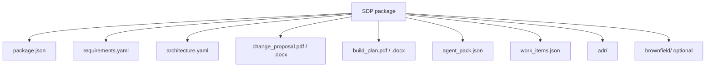

# Software Delivery Package (SDP)

**Status:** v0.2 — aligned with TimeArch change package exports (August 2026)  
**Purpose:** Single handoff format from TimeArch (via Orchestrator) to Coding — and the durable record of a Run.

---

## 1. Design principles

1. **Dual audience** — humans (stakeholders, architects) and machines (coding LLMs, CI).  
2. **Immutable** — each export is versioned; never rewrite an accepted package in place.  
3. **Traceable** — every work item, ADR, and requirement has a stable ID.  
4. **Gate-aware** — machine JSON includes `authorization.may_implement`; agents must not code until gates pass.  
5. **Repo-ready** — Coding’s job is a PR, not a chat transcript.

---

## 2. What TimeArch exports today

From the **Change package** step (brownfield) or future orchestrated export (greenfield):

| Artifact | Format | Audience |
|----------|--------|----------|
| **Change Proposal (SCP)** | PDF, DOCX, on-screen pages | Stakeholders |
| **Implementation Build Plan (SIP)** | PDF, DOCX, on-screen pages | Engineers |
| **`agent_pack.json`** | JSON (`kind: "agent_pack"`, schema v4) | Coding LLMs, CI, Orchestrator |
| Markdown excerpts | Copy to clipboard | Wikis, PR descriptions |

Human documents use formal titles (e.g. *Change Proposal for {Project}*), document control blocks (ID, revision, date), numbered SRS-style sections, and separate cover / TOC / body pages.

---

## 3. Package layout

One folder or ZIP (example: `sdp-<runId>-v<n>.zip`):



```text
sdp/
  package.json              # Manifest (required)
  requirements.yaml         # From RE / TimeArch
  architecture.yaml         # Components, APIs, data, QAs
  change_proposal.pdf       # Stakeholder SCP (or change_package.md)
  build_plan.pdf            # Engineer SIP (or coding_brief.md)
  agent_pack.json           # Machine handoff (required for agents)
  work_items.json           # Ordered tasks + acceptance criteria
  adr/                      # Decision records (Go verdicts only)
    ADR-001-....md
  brownfield/               # Optional (existing systems)
    imports_summary.json
    mappings.json
    ripple.json
  traces/                   # Optional audit
    agent_runs.json
```

More visuals: [Diagrams §5 SDP contents](./Diagrams.md#5-sdp-contents-artifact-map).

---

## 4. `agent_pack.json` (primary machine contract)

Coding agents and the Orchestrator should treat this file as the **source of truth** for implementation scope.

Minimum shape (schema v4):

```json
{
  "kind": "agent_pack",
  "schema_version": 4,
  "feature_change_id": "fc_…",
  "project": "My System",
  "title": "Add OAuth login",
  "status": "approved",
  "generated_at": "2026-08-12T…",
  "exported_at": "2026-08-12T…",

  "summary": {
    "one_line_goal": "Add OAuth login",
    "today_system": "Email/password only",
    "target_system": "OAuth + existing email login",
    "package_id": "fc_…"
  },

  "authorization": {
    "may_implement": true,
    "gates_approved": 3,
    "gates_total": 3
  },

  "implement_now": {
    "allowed": true,
    "stop_reason": null,
    "target_files": ["src/auth/…"],
    "proposed_features": ["OAuth login"],
    "required_adrs": [],
    "required_acceptance_criteria": [],
    "required_tests": []
  },

  "scope": { },
  "diagrams": { "as_is": "…mermaid…", "to_be": "…mermaid…" },
  "agent_rules": ["Implement only scope.go_* items", "…"],
  "execution_checklist": ["1. Read authorization first", "…"],
  "documents": {
    "implementation_brief": "…",
    "human_markdown": "…",
    "agent_markdown": "…"
  }
}
```

**Agent read order:** `authorization` → `implement_now` → `agent_rules` → `current_behavior` / `desired_behavior` → `diagrams` → `documents.implementation_brief`.

If `implement_now.allowed` is `false`, stop and request human approval.

Download from the app: Change package → **Machine record** tab.

---

## 5. Manifest (`package.json`)

Minimum fields for orchestrated ZIP exports:

```json
{
  "schema_version": "0.2",
  "run_id": "run_01H…",
  "project_id": "…",
  "feature_change_id": "…",
  "mode": "greenfield | brownfield | hybrid",
  "produced_by": "timearch",
  "produced_at": "2026-08-12T00:00:00Z",
  "content_hashes": {
    "agent_pack.json": "sha256:…",
    "requirements.yaml": "sha256:…"
  },
  "upstream": {
    "requirements_package_id": "…"
  },
  "status": "draft | approved | superseded"
}
```

---

## 6. `work_items.json` (Coding checklist)

```json
{
  "items": [
    {
      "id": "wi_001",
      "ordering": 0,
      "title": "Add JWT middleware to checkout API",
      "category": "implementation",
      "priority": "high",
      "effort": "M",
      "description": "…",
      "acceptance_criteria": [
        "Unauthenticated requests return 401",
        "Contract tests updated"
      ],
      "dependencies": [],
      "requirement_ids": ["REQ-12"],
      "architecture_refs": ["component:CheckoutService"]
    }
  ]
}
```

In brownfield today, work items are embedded in `agent_pack.json` scope and build plan documents; standalone `work_items.json` is the target for Orchestrator ZIP exports.

---

## 7. Human document parts

### Change Proposal — SCP (stakeholders)

Numbered sections typically include:

1. Introduction and purpose  
2. Existing system baseline (recovered features, as-is figure)  
3. Proposed changes  
4. Target architecture (to-be figure)  
5. Impact and risk  
6. Decisions summary (Go ADRs)  
7. Delivery roadmap  
8. Release gates  
9. Appendix — excluded / pending items  

### Implementation Build Plan — SIP (engineers)

1. Purpose and authorization  
2. Implementation scope (Go-only)  
3. Rules before coding  
4. Architecture decisions  
5. Requirements to satisfy  
6. Mandatory verification (tests)  
7. Release status  

---

## 8. What Coding returns

Not part of the SDP export from TimeArch, but the **return contract** to the Orchestrator:

| Artifact | Purpose |
|----------|---------|
| Git PR / branch URL | Implementation |
| `verification.json` | Tests, lint, coverage summary |
| `work_item_results.json` | `wi_id` → commits / files / status |
| `blockers.md` (optional) | Questions that need RE or Arch |

**Done means:** every Go work item linked or explicitly deferred; acceptance criteria checked or waived; required tests reported; lineage stored on the Run.

---

## 9. Mapping from TimeArch (implementation guide)

| TimeArch source | SDP file |
|-----------------|----------|
| `requirements`, `feature_changes` | `requirements.yaml` |
| `architecture_artifacts`, ADR content | `architecture.yaml`, `adr/` |
| Change package builder (`changePackageDocument.ts`) | SCP / SIP PDFs |
| `buildAgentPack()` / dev handoff | `agent_pack.json` |
| `feature_mappings`, `impact_findings` | `brownfield/` |
| `feature_work_items` | `work_items.json` |
| Agent runs / traces | `traces/` |

---

## See also

- [Brownfield Discovery](./Brownfield-Discovery.md)  
- [Software Factory Integration](./Software-Factory-Integration.md)  
- [Home](./Home.md)
