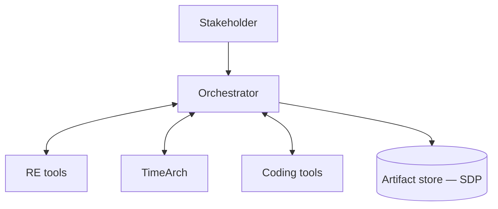

# Software Factory Integration

**Status:** Draft for partner discussion  
**Owners:** TimeArch (architecture) · RE team · Coding team · Orchestration  
**Last updated:** August 2026

---

## 1. Context

We are building one authentic software pipeline across three specialist systems:

| System | Team focus | Responsibility |
|--------|------------|----------------|
| **RE tools** | Requirements engineering | Elicit, evaluate, normalize requirements from users/stakeholders |
| **TimeArch** | Design & architecture | Turn requirements (and optional as-is systems) into architecture, decisions, and an implementable plan |
| **Coding tools** | Implementation | Produce code, tests, and a PR against a real repository |
| **Orchestration layer** | Glue / control plane | Drive the workflow, move artifacts, enforce gates, keep audit trail |

**Goal:** Requirements in → architecture & design → code out, with lineage and human approval — not three disconnected tools.

---

## 2. One-sentence pitch

> Treat each team tool as a specialist **worker**. Put a thin **Orchestrator** in the middle that moves a single versioned **Software Delivery Package (SDP)** between stages. Tools never call each other ad hoc.

---

## 3. Recommended connection model

### 3.1 Hub-and-spoke (recommended)

> Full diagrams: [Diagrams — Software Factory](./Diagrams.md)

**Rules:**

1. Only the Orchestrator may **start** a stage and mark a stage **complete**.
2. Tools expose a small API (start job + webhook/callback when done).
3. Artifacts are immutable and content-addressed in a shared store.
4. Identity is shared (SSO / OIDC) so every run has clear attribution.

### 3.2 End-to-end flow

1. Stakeholder submits intent → Orchestrator creates a **Run**.
2. Orchestrator calls **RE** → waits for **Requirements Package** (approved).
3. Orchestrator calls **TimeArch** with that package (+ brownfield sources if any).
4. TimeArch returns **Architecture / Change Package** (approved gate).
5. Orchestrator calls **Coding** with the SDP + target repo context.
6. Coding returns **PR URL + verification report** → Orchestrator closes the Run (or loops on gaps).

See the full sequence diagram in [Diagrams](./Diagrams.md#2-end-to-end-sequence-happy-path).

### 3.3 Do / Don't

| Do | Don't |
|----|--------|
| Versioned shared SDP schema | Pairwise RE↔TimeArch DB writes |
| Orchestrator owns run IDs & audit | TimeArch calling Coding APIs directly |
| Human gates after RE and after Arch | Unstructured chat dumps as contract |
| Async jobs for long LLM work | One monolith UI for all teams |
| Idempotent retries per run | Silent handoffs with no status |

### 3.4 Orchestrator building blocks

| Layer | Practical choice | Why |
|-------|------------------|-----|
| Control plane | Workflow engine (Temporal / Conductor / custom state machine) | Long steps, retries, human waits |
| API | REST/gRPC + webhooks | Easy for every team to implement |
| Events | Message bus (NATS / Kafka / Redis streams) | Decouple producers from consumers |
| Artifact store | Object storage + hashed JSON/MD | Immutable, auditable |
| Identity | Shared SSO (Google/OIDC) | One user across tools |

---

## 4. What each system produces

| From | Produces | Consumed by |
|------|----------|-------------|
| RE | Normalized **Requirements Package** | Orchestrator → TimeArch |
| TimeArch | **Architecture Package** + **Change Package** → exported as **SDP** | Orchestrator → Coding |
| Coding | **Git PR** + `verification.json` + work-item→file map | Orchestrator / stakeholders |
| Orchestrator | Run state, approvals, lineage | Everyone (audit & UX) |

See [Software Delivery Package (SDP)](./Software-Delivery-Package.md) for the exact file layout.

---

## 5. How TimeArch fits (implemented → next)

### Implemented in the app (August 2026)

| Capability | Where in TimeArch | Orchestrator-facing output |
|------------|-------------------|----------------------------|
| Brownfield import | Discovery → Import (GitHub, ZIP, demo) | `project_imports` + stored files |
| As-is recovery | Discovery → Recover | Inventory, Mermaid as-is, narrative |
| Change analysis | Discovery → Change → Re-analyze | Mappings, impact, ADRs, AC, tests |
| Human gates | Review decisions + Build guide + Release | Go / No-go / Drop verdicts |
| Change package | Change package tab | SCP + SIP (PDF/DOCX) + on-screen pages |
| Agent handoff | Machine record tab | `agent_pack.json` (`kind: "agent_pack"`, v4) |
| External access | Settings → Integrations | REST API, MCP, CLI (see [INTEGRATIONS.md](../INTEGRATIONS.md)) |
| Case lifecycle | Dashboard milestones + Close case | 5-step brownfield progress, locked project |

See [Brownfield Discovery](./Brownfield-Discovery.md) for the user workflow.

### Still proposed for Orchestrator ZIP export

| Today in TimeArch | Expose to Orchestrator as |
|-------------------|---------------------------|
| Project + requirements | `requirements.yaml` |
| Architecture artifacts / ADRs | `architecture.yaml` + `adr/*.md` |
| Feature changes + work items | `work_items.json` |
| Change package exports | `change_proposal.pdf`, `build_plan.pdf`, `agent_pack.json` |
| Agent runs / traces | `traces/` (optional) |

**Near-term TimeArch APIs (proposed):**

- `POST /runs/import-requirements` — ingest RE package into a project  
- `POST /runs/export-sdp` — emit full SDP ZIP from project / feature change  

TimeArch stays the **architecture brain**, not the bus.

---

## 6. Phased roadmap

| Phase | Scope | Exit criteria |
|-------|--------|----------------|
| **P0 · Contracts** | Agree SDP schema v0.1 + run state machine | All three teams sign the schema |
| **P1 · Greenfield happy path** | RE → Orch → TimeArch → Orch → Coding on one demo app | PR from SDP with ≥1 passing test suite |
| **P2 · Brownfield path** | Import existing system into TimeArch; Change Package → Coding | **In progress** — UI + `agent_pack.json` shipped; Orchestrator ZIP export pending |
| **P3 · Hardening** | Approvals, retries, SSO, audit UI | Failed run can be replayed without data loss |

---

## 7. Decisions to lock with partners

See [Team Decisions Log](./Team-Decisions-Log.md).

1. Orchestrator owns workflow — tools are workers.  
2. SDP is the only handoff format.  
3. Human approval after RE and after TimeArch before Coding.  
4. Coding returns a PR + verification, not chat-only files.  
5. TimeArch priority = stable import/export APIs (not more UI phases).

---

## 8. Glossary

| Term | Meaning |
|------|---------|
| **Run** | One end-to-end attempt to deliver a change or new system |
| **SDP** | Software Delivery Package — canonical handoff ZIP/folder |
| **Change Package** | TimeArch dual-audience Markdown (stakeholders + coding brief) |
| **Gate** | Human or policy checkpoint before the next stage starts |
| **Lineage** | Trace from requirement → decision → work item → commit |

---

## See also

- [Software Delivery Package (SDP)](./Software-Delivery-Package.md)  
- [Team Decisions Log](./Team-Decisions-Log.md)  
- [Home](./Home.md)
